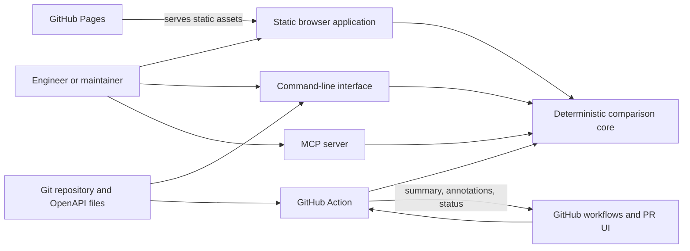
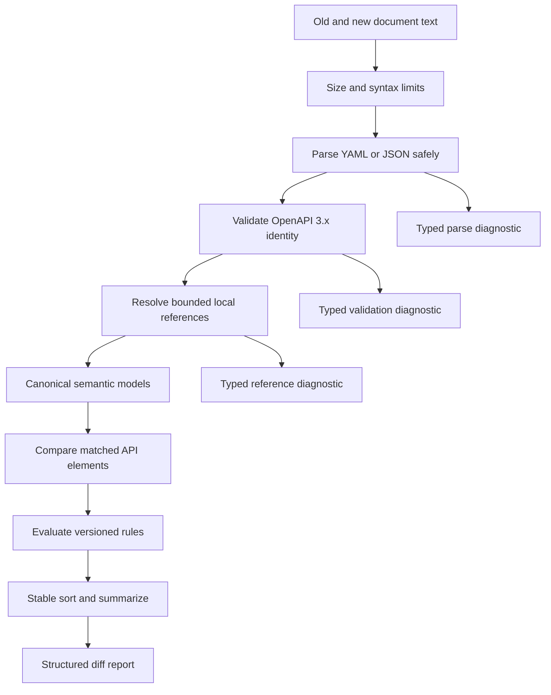
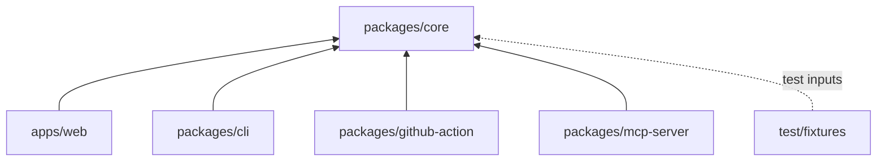
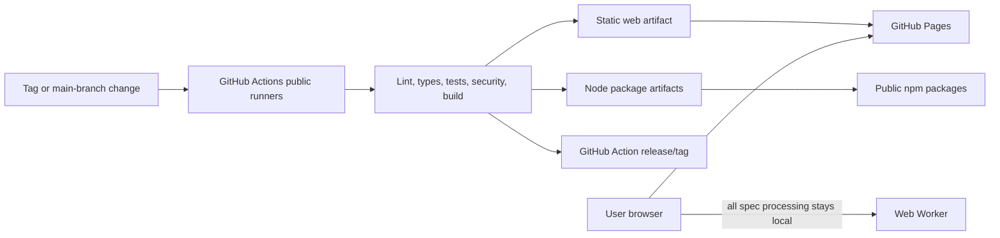

# ContractGuard Solution Design

**Status:** Draft
**Date:** 2026-07-18
**Related:** [Product requirements](../product/PRD.md), [ADR 0001](../adr/0001-project-architecture.md)

## 1. Purpose and constraints

ContractGuard compares two OpenAPI 3.x YAML or JSON documents and emits a deterministic report of breaking and non-breaking changes. One comparison policy and report format must serve every interface. The initial system has no backend, database, user accounts, paid AI dependency, or mandatory telemetry. Browser inputs remain on the user's device.

The proposed baseline is a TypeScript ESM pnpm workspace. Tool and version choices remain proposals until the repository toolchain is initialized.

## 2. System context



The web application is a static client, not a client for a hidden service. CLI, GitHub Action, and MCP packages are delivery adapters around the same core. AI may assist development, review, testing, and documentation, but it is outside the runtime, comparison path, and authoritative test oracles.

## 3. Architecture boundaries

- `packages/core` owns parsing, normalization, rule evaluation, classification, and report generation. It must not import browser, Node.js, GitHub, CLI, or MCP APIs.
- The core performs no file, network, clock, random, environment-variable, or process I/O. Adapters provide input text and consume structured output.
- Each adapter translates its transport into core inputs; it must not reimplement comparison rules.
- Rules have stable identifiers, documented rationale, explicit OpenAPI applicability, and focused tests.
- Given semantically equivalent supported inputs, options, core version, and rule-set version, canonical output is byte-for-byte stable. Collections are explicitly sorted and reports contain no implicit timestamps or machine-specific paths.
- External `$ref` retrieval is disabled. Local document references may be resolved with bounded depth; cross-file references require an explicit future design.

## 4. Major components

| Component | Responsibility |
| --- | --- |
| Browser app | Accept two files or pasted documents, run comparisons in a Web Worker, and render/filter/export accessible reports without uploading inputs. |
| Core library | Parse YAML/JSON, validate supported OpenAPI versions, build a canonical semantic model, apply versioned rules, and return typed results and diagnostics. |
| CLI | Read explicitly named local files, invoke the core, print human or JSON output, and map results/errors to documented exit codes. |
| GitHub Action | Locate base/head specifications, invoke the core, publish a workflow summary or annotations, and enforce a configured breaking-change policy. |
| MCP server | Expose comparison capabilities through MCP, validate tool arguments, and return structured core results; the initial transport is local stdio. |
| Build/release automation | Run quality gates, build static/browser and Node artifacts, deploy the web app, and publish versioned packages/releases. |

### Core comparison pipeline



The result contract should include a schema version, rule-set version, summary counts, changes, and diagnostics. Each change includes a stable rule ID, classification, JSON Pointer-like location, concise explanation, and relevant before/after values. Unknown constructs produce diagnostics rather than guessed classifications.

## 5. Proposed monorepo structure

```text
contractguard/
├── apps/
│   └── web/                    # Static UI and Web Worker
├── packages/
│   ├── core/                   # Environment-neutral comparison engine
│   ├── cli/                    # Node CLI adapter
│   ├── github-action/          # GitHub workflow adapter and metadata
│   └── mcp-server/             # Local stdio MCP adapter
├── test/
│   └── fixtures/               # Reviewed OpenAPI pairs and expected reports
├── docs/
│   ├── product/
│   ├── architecture/
│   ├── testing/
│   └── adr/
├── package.json                # Root scripts only
├── pnpm-workspace.yaml
├── pnpm-lock.yaml
└── tsconfig.base.json
```

`apps/web` is private and deployable. `packages/core`, `packages/cli`, and `packages/mcp-server` are candidates for public npm packages. `packages/github-action` produces the bundled JavaScript and action metadata needed by GitHub. Shared types belong in `core` until a demonstrated independent consumer justifies another package. Root scripts orchestrate workspaces; no task-runner service is required initially.

The dependency direction is deliberately small:



## 6. Data flow

1. An adapter obtains two specification texts and explicit comparison options.
2. It rejects unsupported transport-level inputs, then sends plain data to the core.
3. The core applies resource limits, parses and validates both inputs, normalizes relevant semantics, evaluates rules, and returns a structured report or typed failure.
4. The adapter renders that report without changing its classification.

In the browser, the main thread transfers file text to a dedicated Web Worker. The worker invokes the core and returns progress, diagnostics, and results; it does not call a server or persist document content. The CLI reads only explicitly named paths. MCP starts with content input; any future path mode requires configured allowed roots and a follow-up threat review. The Action receives GitHub-provided workspace context and should default to read-only repository permissions.

## 7. Deployment model and zero-cost path



The production web application is static and can use the repository's default GitHub Pages domain, avoiding a required paid domain. Public-repository GitHub Actions runners provide the proposed CI/deployment path, while public npm packages and GitHub releases distribute other interfaces. The proposed CI configuration uses standard runners, short artifact retention, and a zero-spend budget; it disables larger runners and usage that can incur overage. No runtime server, database, paid AI API, analytics vendor, or secret is required. Usage and terms for no-cost services must be checked before release; a terms change is a tracked operational risk, not permission to add a paid dependency silently.

## 8. Security and privacy

- Never upload, log, cache, or persist browser specification contents. Use in-memory processing and remove references after a comparison is replaced.
- Do not fetch URLs or external `$ref` targets. Avoid third-party runtime scripts, fonts, analytics, and CDNs; use the strongest restrictive Content Security Policy the static host supports.
- Enforce configurable byte, nesting, node-count, alias-expansion, reference-depth, and execution limits to mitigate malicious or accidental resource exhaustion.
- Parse as data only. Guard against YAML alias bombs, prototype pollution, unsafe schema keys, path traversal, terminal escape injection, HTML injection, and untrusted Markdown.
- Render all document-derived strings as escaped text. Downloads use fixed safe MIME types and sanitized filenames.
- Pin dependencies and CI actions, review lockfile changes, run dependency/license checks, and use least-privilege workflow permissions. Release publishing should use short-lived trusted identity where supported.
- The MCP and CLI adapters access only explicit arguments. The MCP server starts with stdio only and no unauthenticated network listener.
- Reports may contain excerpts from private specifications; adapters must warn before publishing them to PR comments or artifacts and should minimize excerpts by default.

## 9. Failure handling

Failures are typed by stage: input-limit, parse, unsupported-version, validation, reference, comparison, or adapter error. Messages identify the affected document and safe location without exposing entire inputs. A malformed document never yields a partial compatibility verdict. Unsupported but parseable constructs generate prominent diagnostics and an indeterminate status where correctness is not assured.

The web worker reports failure without freezing the UI and can be terminated on timeout. CLI exit codes distinguish success/no breaking changes, policy violation, invalid input, and internal error. The Action fails predictably according to configuration and still writes a concise summary. MCP returns protocol-compliant structured errors. Internal errors preserve a correlation-free local diagnostic; no automatic remote crash upload occurs.

## 10. Observability

Observability is local and privacy-preserving. Each adapter may expose duration, phase, counts, core version, and rule-set version, but not specification content, paths unless requested, or schema names. CLI verbose output and Action step logs are opt-in or appropriately redacted. The browser may show an in-session diagnostics panel; there is no analytics or remote telemetry in the MVP. CI publishes test/build summaries and non-sensitive coverage artifacts. Reproducibility relies on report metadata and fixture tests rather than user tracking.

## 11. Technical risks and mitigations

| Risk | Mitigation |
|---|---|
| OpenAPI and JSON Schema semantics make compatibility classification nuanced. | Start with a documented conservative rule matrix, stable IDs, fixtures from real patterns, and explicit `indeterminate` diagnostics. |
| YAML parsing or references enable denial of service. | Use a browser-compatible safe parser, disable external resolution, enforce structural limits, and test hostile fixtures. |
| Browser bundles or large specs cause slow comparisons. | Keep core dependencies small, process in a worker, benchmark representative/limit fixtures, and allow cancellation. |
| Interfaces drift in policy or output. | Keep rules and report types in `core`; run contract tests against every adapter. |
| GitHub Action packaging is awkward in a monorepo. | Automate a reproducible bundle and verify `action.yml` in CI; decide release/tag layout before Action beta. |
| Free hosting, CI, or registry terms change. | Keep deployment static and portable, monitor quotas/terms, and retain documented alternatives such as another no-cost static host or local builds. |
| The static host cannot set every desired security header. | Evaluate Pages during discovery, use a restrictive CSP meta policy where valid, document unsupported directives, and choose another no-cost static host if the threat model requires headers. |
| Supply-chain compromise affects local specs. | Minimize dependencies, pin versions/actions, use provenance where available, and review updates. |

## 12. Alternatives considered

- **Backend comparison API:** rejected for MVP because it would upload sensitive contracts, require operations and likely storage, and threaten the zero-cost constraint.
- **Database and accounts:** rejected because comparisons are ephemeral and anonymous use is required.
- **Separate implementation per interface:** rejected because classifications would drift and maintenance would multiply.
- **AI-based classification:** rejected because output must be deterministic, reproducible, private, and free of paid runtime APIs.
- **Node-only core:** rejected because browser-local processing is a critical privacy requirement.
- **Microservices or multiple repositories:** rejected as unnecessary operational and release complexity for one maintainer.
- **Heavy monorepo orchestration:** deferred; pnpm workspace scripts are sufficient until measured build scale justifies another tool.
- **Server-side WebAssembly engine:** not selected initially; TypeScript maximizes shared code and contributor accessibility. A sandboxed parser or performance-critical module can be reconsidered from benchmarks.

## 13. Assumptions

- “OpenAPI 3.x” initially means 3.0.x and 3.1.x documents, with support differences stated in the rule catalog.
- Both complete documents fit within documented browser memory and input limits; streaming comparison is not required for MVP.
- The web app accepts local files and paste input, not URLs, repositories, archives, or authenticated APIs.
- A public repository can use standard no-cost GitHub Pages, GitHub Actions, GitHub releases, and public npm distribution within applicable limits.
- Consumers accept a versioned ContractGuard compatibility policy where OpenAPI itself does not define breaking-change semantics.

## 14. Unresolved decisions

- Exact supported rule set and conservative treatment of ambiguous changes, including response-field additions, enum evolution, and composition keywords.
- Parser/validator libraries and the precise normalization strategy for OpenAPI 3.0 versus 3.1 JSON Schema dialects.
- Whether mixed OpenAPI 3.0/3.1 comparisons are supported and how dialect-only changes are reported.
- Default and maximum input, reference-depth, and execution limits, to be established through security tests and benchmarks.
- Web UI framework and build tooling; any selection must support static output, workers, accessibility, and a small dependency footprint.
- Whether GitHub Pages' security-header controls satisfy the threat model or another no-cost static host is required.
- Canonical JSON report schema, human output format, and whether SARIF is included in CLI/Action MVP.
- GitHub Action distribution layout, PR annotation limits, and fork pull-request behavior.
- MCP tool names and whether a later path-input mode is justified beyond the content-only default.
- Versioning policy across core rules, adapters, report schemas, and fixture expectations.

Resolve material choices through follow-up ADRs before implementation makes them costly to reverse.
